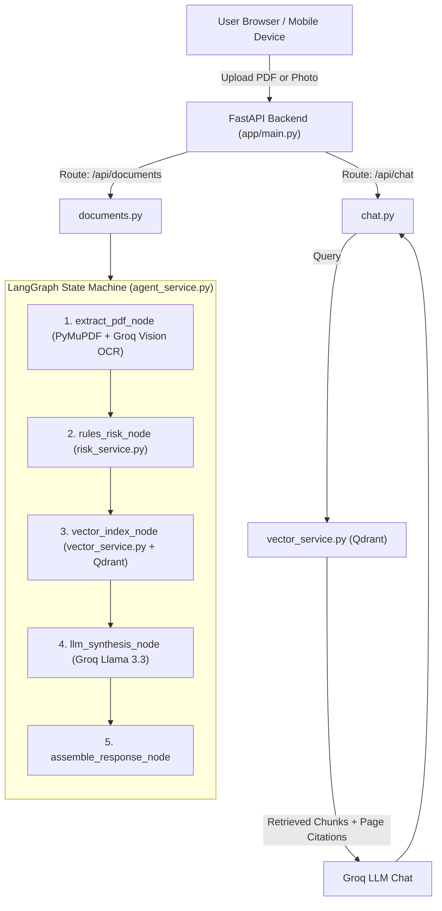

# ClauseGuard — Product Requirements Document

**Version:** 1.1 (Production Ready)  
**Date:** 2026  
**Author:** Waniya  
**Status:** Completed & Implemented  

---

## 1. Problem Statement

People in Pakistan sign contracts, rental agreements, job offers, freelance contracts, and NDAs without reading them carefully. Critical clauses are hidden in legal jargon that most people cannot understand.

**Real Examples:**
- **Tenant**: Signs rental agreement — security deposit was non-refundable and landlord enters without notice.
- **Employee**: Signs job offer — 6-month bond existed and non-compete restricts future jobs.
- **Freelancer**: Signs client contract — all IP rights and source files transferred without kill-fee protection.
- **Borrower**: Signs loan agreement — compound interest and sudden acceleration clauses hidden.

---

## 2. Solution

An AI-powered legal document risk analysis tool that:
- Accepts digital PDFs and camera photos / screenshots (PDF, PNG, JPG, JPEG).
- Automatically triggers Vision OCR on scanned documents.
- Evaluates contracts against Pakistani legal principles (Contract Act 1872, Rent Restriction Ordinance 1959, Payment of Wages Act 1936).
- Generates an instant Risk Score (0-100) and severity category (LOW / MEDIUM / HIGH).
- Explains findings in friendly, simple, jargon-free English.
- Provides interactive follow-up chat grounded in the uploaded document with exact page citations.

---

## 3. Target Users

| User Type | Use Case |
|-----------|----------|
| Students | Review internship and job offers |
| Tenants | Understand rental agreements & deposit clauses |
| Employees | Check probation, bond, and salary deduction terms |
| Freelancers | Verify IP rights, kill fees, and payment timelines |
| Small Businesses | Check vendor agreements and liability terms |

---

## 4. Core Features

### F1: Multi-Format Document Ingestion & Vision OCR
- Accepts PDF, PNG, JPG, and JPEG files (max 10MB).
- Direct mobile camera capture support (`capture="environment"`).
- In-memory image-to-PDF conversion without redundant disk copies.
- Automated Scanned / Image Detection.
- **Groq Vision OCR (`llama-3.2-11b-vision-preview`)** fallback for zero-installation transcription of scanned docs and photos.

### F2: Hybrid Risk Analysis
- **Phase 1 (Rules Engine)**: Deterministic, fast keyword scanning for universal and document-specific clauses (Rental, Employment, Freelance, NDA, Loan).
- **Phase 2 (LLM Synthesis)**: Groq Llama 3.3 contextual evaluation, ensuring groundedness and eliminating false alarms.
- Generates normalized Risk Score (0-100) and severity level (LOW, MEDIUM, HIGH) with dynamic color badge.

### F3: AI Legal Guardian Breakdown
- Plain, friendly, jargon-free English summary.
- Key Rights & Protections highlighted.
- Risky Clauses & Traps broken down with real-world scenarios and Pakistani law citations.
- Practical negotiation action plan before signing.

### F4: Grounded Follow-up RAG Chat
- Local Qdrant vector database with tenant isolation (`doc_id` filtering).
- Semantic retrieval with FastEmbed ONNX embeddings (`BAAI/bge-small-en-v1.5`).
- Groq LLM answers questions strictly grounded in the contract.
- Cites specific page numbers (e.g., *"[From Page 2]"*).

---

## 5. Technical Architecture



---

## 6. Tech Stack

| Component | Technology | Reason |
|-----------|------------|--------|
| **Backend API** | FastAPI + Uvicorn | Async, high performance, automatic OpenAPI documentation |
| **Agent Framework** | LangGraph | State machine for reliable multi-step execution |
| **Document Parsing** | PyMuPDF (`fitz`) | Industry standard for PDF manipulation and image conversion |
| **Vision OCR** | Groq Vision (`llama-3.2-11b-vision-preview`) | 100% Free, zero local C++ software installation needed |
| **Embeddings** | FastEmbed (`BAAI/bge-small-en-v1.5`) | 100% Free, offline ONNX CPU runtime, lightweight (~67MB) |
| **Vector Database** | Qdrant (Local mode) | Persistent local vector store in `./qdrant_data/` with tenant filtering |
| **LLM Inference** | Groq (`llama-3.3-70b-versatile`) | Blazing fast, 100% Free developer tier, temperature 0.1 |
| **Frontend UI** | HTML5 + Tailwind CSS + Lucide Icons | Responsive (Desktop + Mobile), direct camera capture, zero build steps |
| **Package Manager** | UV | Modern, ultra-fast Python package manager |

---

## 7. Project Folder Structure

```text
ClauseGuard/
│
├── app/
│   ├── __init__.py
│   ├── main.py               # FastAPI app entry point, CORS, routers & UI mounting
│   ├── config.py             # Pydantic environment settings
│   │
│   ├── routes/
│   │   ├── __init__.py
│   │   ├── documents.py      # /api/documents/analyze and /{doc_id} endpoints
│   │   └── chat.py           # /api/chat/ask RAG endpoint
│   │
│   ├── services/
│   │   ├── __init__.py
│   │   ├── pdf_service.py    # Document parsing, image conversion & Vision OCR
│   │   ├── vector_service.py # Qdrant vector operations & FastEmbed
│   │   ├── risk_service.py   # Phase 1 rules-based risk scoring logic
│   │   └── agent_service.py  # LangGraph state machine & RAG chat execution
│   │
│   ├── models/
│   │   ├── __init__.py
│   │   └── schemas.py        # Pydantic request/response schemas
│   │
│   └── prompts/
│       ├── __init__.py
│       └── analysis.py       # English legal prompts for summary & chat
│
├── frontend/
│   ├── index.html            # Responsive dashboard, camera upload & chat drawer
│   └── .gitkeep
│
├── tests/
│   ├── __init__.py
│   └── test_basic.py         # Automated unit & integration tests
│
├── uploads/                  # Temporary document storage (gitignored)
├── qdrant_data/              # Local Qdrant vector index storage (gitignored)
├── .env                      # Secret keys (GROQ_API_KEY) (gitignored)
├── .env.example              # Public environment template
├── .gitignore                # Git ignore configuration
├── PRD.md                    # Product Requirements Document
├── README.md                 # Project overview
└── pyproject.toml            # UV dependencies & metadata
```

---

## 8. API Design

| Method | Endpoint | Description |
|--------|----------|-------------|
| GET | `/` | Serves web dashboard UI |
| GET | `/health` | Service health check |
| GET | `/docs` | Interactive Swagger API documentation |
| POST | `/api/documents/analyze` | Upload and analyze PDF or image (PNG/JPG/JPEG) |
| GET | `/api/documents/{id}` | Get previous analysis report by document ID |
| POST | `/api/chat/ask` | Ask follow-up question with grounded RAG retrieval |

---

## 9. Risk Scoring Rules & Weighting

Normalized Risk Score Formula:
$$\text{Score} = \min\left(100, \left\lfloor \frac{\text{Raw Points Found}}{\text{Max Possible Points for Doc Type}} \times 100 \right\rfloor\right)$$

### Risk Categories:
- 🟢 **LOW RISK (0 – 39)**: Standard agreement. Minor or no non-standard terms.
- 🟡 **MEDIUM RISK (40 – 69)**: Caution recommended. Review highlighted sections carefully.
- 🔴 **HIGH RISK (70 – 100)**: Dangerous terms detected. Seek legal advice or negotiate before signing.

---

## 10. Development Status

| Phase | Milestone | Status |
|-------|-----------|--------|
| **Phase 1** | Project setup, config, schemas, rules-based risk service | ✅ Completed |
| **Phase 2** | PDF parsing, multi-format image support, sanitization | ✅ Completed |
| **Phase 3** | Groq Vision OCR fallback for scanned docs & photos | ✅ Completed |
| **Phase 4** | Qdrant vector store & FastEmbed local embeddings | ✅ Completed |
| **Phase 5** | Production prompt engineering (English, jargon-free) | ✅ Completed |
| **Phase 6** | LangGraph state machine pipeline & RAG chat | ✅ Completed |
| **Phase 7** | FastAPI REST endpoints & in-memory caching | ✅ Completed |
| **Phase 8** | Responsive, mobile-first frontend UI & camera input | ✅ Completed |
| **Phase 9** | Comprehensive automated test suite | ✅ Completed |